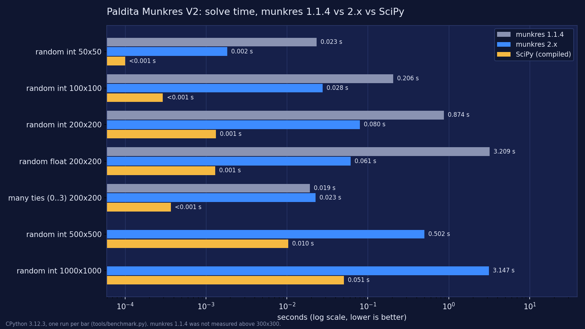

# Benchmarks

Measured on `Linux-6.18.44-fc-v70-x86_64-with-glibc2.39`, Python 3.12.3, single run per cell (`tools/benchmark.py`). Your numbers will differ; the ratios are what matter.

| case | munkres 1.1.4 | **munkres 2.x** | SciPy (compiled) |
|------|--------------:|----------------:|-----------------:|
| random int 50x50 | 0.023 s | **0.002 s** | 0.000 s |
| random int 100x100 | 0.206 s | **0.028 s** | 0.000 s |
| random int 200x200 | 0.874 s | **0.080 s** | 0.001 s |
| random float 200x200 | 3.209 s | **0.061 s** | 0.001 s |
| many ties (0..3) 200x200 | 0.019 s | **0.023 s** | 0.000 s |
| random int 500x500 | n/a | **0.502 s** | 0.010 s |
| random int 1000x1000 | n/a | **3.147 s** | 0.051 s |

munkres 2.x is pure Python (no dependencies); SciPy is compiled C++. Use SciPy when raw speed on big dense problems is all that matters. 1.1.4 was not measured above 300x300.
